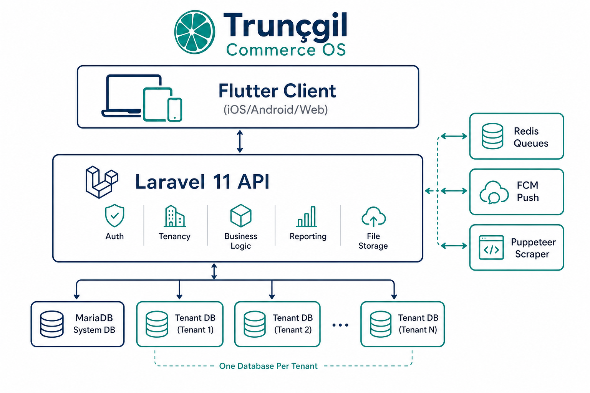
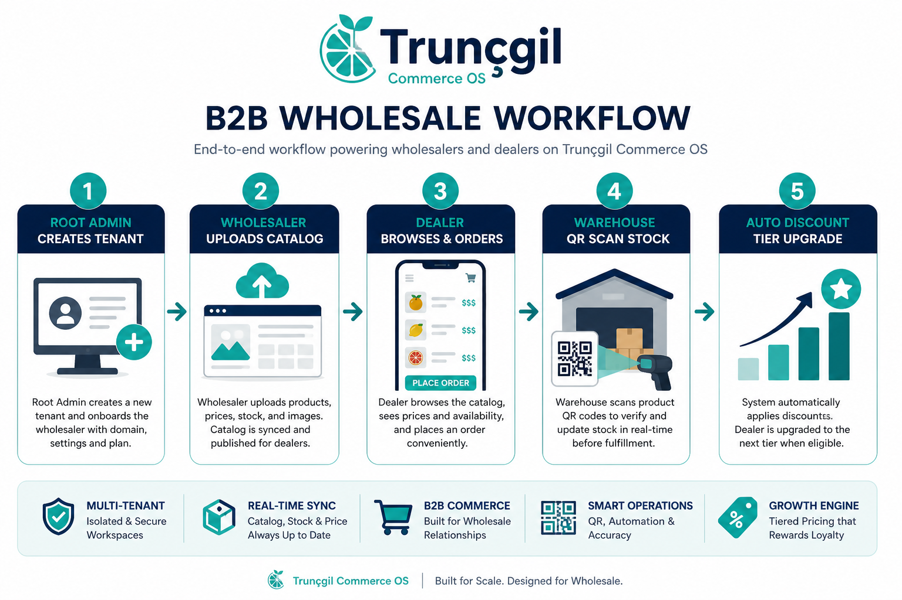
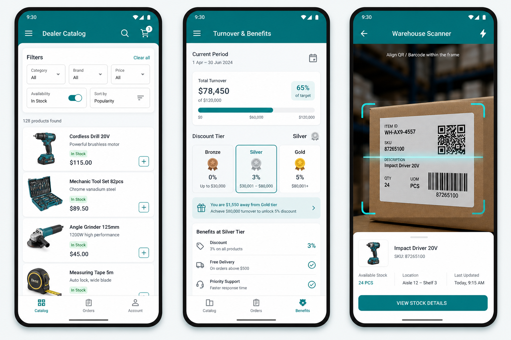

<p align="center">
  
</p>

<h1 align="center">Trunçgil Commerce OS</h1>

<p align="center">
  <strong>Evrensel çok sektörlü B2B toptancı & bayi yönetim platformu</strong><br/>
  Multi-database SaaS · Laravel 11 · Flutter 3 · MariaDB 11
</p>

<p align="center">
  <a href="https://github.com/Faruk-T/B2B_saas_project">
    
  </a>
  
  
  
  
</p>

---

## Bu proje ne?

**Trunçgil Commerce OS**, toptancıların (wholesaler) bayileriyle (dealer) çalışmasını tek platformda toplayan **kurumsal B2B SaaS** altyapısıdır.

> Toptancı hesap açar → kendi izole veritabanını alır → bayiler katalogdan sipariş verir → depo QR ile stok günceller → ciro hedefi aşılınca iskonto kademesi otomatik yükselir.

### Kimler kullanır?

| Rol | Görev |
|-----|-------|
| **Root Admin** | Toptancı (tenant) oluşturma, abonelik, sistem izleme |
| **Toptancı Admin** | Katalog, filtreler, iskonto kademeleri, tedarikçi, stok |
| **Bayi (Dealer)** | Ürün gezme, sipariş, ciro ilerlemesi takibi |
| **Tedarikçi** | Konsinye stok güncelleme, kritik stok uyarıları |
| **Plasiyer** | Saha satış — müşteri adına sipariş |
| **Depo Personeli** | QR ile stok giriş / çıkış / transfer |

---

## İş akışı

<p align="center">
  
</p>

1. **Root Admin** yeni toptancı açar → sistem `b2b_tenant_{alias}_db` veritabanını oluşturur  
2. **Toptancı** ürün kataloğunu yükler, sektöre göre filtreleri ayarlar  
3. **Bayi** mobil/web'den giriş yapar, filtrelerle ürün bulur, sipariş verir  
4. **Depo** QR kod okutarak stok hareketi kaydeder  
5. **Sistem** teslim edilen ciroyu hesaplar → eşik aşılınca iskonto kademesini yükseltir + push bildirim  

---

## Arayüz önizlemesi (hedef)

<p align="center">
  
</p>

> *Mockup — Phase 4'te Flutter ile geliştirilecek gerçek arayüzler.*

---

## Temel özellikler

| # | Modül | Açıklama |
|---|-------|----------|
| 1 | **Multi-DB Tenancy** | Her toptancıya tamamen izole MariaDB veritabanı |
| 2 | **Çok Sektörlü Motor** | Tekstil matris sipariş, otomotiv OEM uyum, FMCG parti/SKT, m² fiyatlandırma |
| 3 | **Dinamik Filtreleme** | Kategori bazlı çoklu seçim, aralık kaydırıcı, canlı facet sayıları |
| 4 | **Ürün Zenginleştirme** | Barkod/SKU/OEM ile otomatik görsel ve teknik özellik çekme |
| 5 | **QR Stok** | Mobil toplu tarama — giriş, toplama doğrulama, transfer |
| 6 | **Excel Import/Export** | Önizlemeli doğrulama → Redis kuyruğunda asenkron işlem |
| 7 | **Ciro İskonto Motoru** | Teslim edilen ciro eşiği aşılınca otomatik kademe yükseltme + FCM |

---

## Teknoloji yığını

```
┌─────────────────────────────────────────────────────────┐
│  Flutter 3  —  iOS · Android · Web · Desktop            │
│  Clean Architecture + BLoC                              │
├─────────────────────────────────────────────────────────┤
│  Laravel 11 API  —  DDD + Hexagonal Architecture        │
│  Sanctum · Horizon · Scribe/Scalar                      │
├─────────────────────────────────────────────────────────┤
│  MariaDB 11 (system + tenant DB)  ·  Redis  ·  FCM      │
│  Puppeteer (ürün zenginleştirme)  ·  Docker             │
└─────────────────────────────────────────────────────────┘
```

| Katman | Teknoloji |
|--------|-----------|
| Backend | Laravel 11, PHP 8.4, Pest, PHPStan L9 |
| Frontend | Flutter 3, Dio, BLoC, mobile_scanner |
| Veritabanı | MariaDB 11 — `b2b_system_db` + `b2b_tenant_{alias}_db` |
| Kuyruk | Redis, Laravel Horizon, Supervisor |
| Bildirim | Firebase Cloud Messaging |
| Dokümantasyon | Knuckles Scribe + Scalar tema |
| Kalite | Pest mimari testleri, pre-commit hook, GitHub Actions |

---

## 20 günlük geliştirme planı

**4 faz × 5 bölüm = 20 iş günü** (her bölüm = 1 gün)

| Gün | Faz | Bölüm | Konu |
|-----|-----|-------|------|
| **D1** | 1.1 | Planlama | Detaylı plan + README *(bugün — kod yok)* |
| D2 | 1.2 | Altyapı | Docker & geliştirme ortamı |
| D3 | 1.3 | Tenancy | Çoklu veritabanı mimarisi |
| D4 | 1.4 | Provision | Tenant kurulum pipeline |
| D5 | 1.5 | Kalite | Quality gates + Root Admin API |
| D6 | 2.1 | Schema | Çekirdek veritabanı şeması |
| D7 | 2.2 | Domain | Domain katmanı & action'lar |
| D8 | 2.3 | Sektör | Çok sektörlü iş motorları |
| D9 | 2.4 | Arama | Faset filtreleme & dinamik arama |
| D10 | 2.5 | Fiyat | Roller, auth & iskonto motoru |
| D11 | 3.1 | Kuyruk | Redis & Horizon |
| D12 | 3.2 | Scraper | Ürün zenginleştirme |
| D13 | 3.3 | Excel | Toplu XLS import/export |
| D14 | 3.4 | FCM | Push bildirimler |
| D15 | 3.5 | Docs | API dokümantasyonu (Scribe) |
| D16 | 4.1 | Flutter | Core mimari & auth |
| D17 | 4.2 | Portal | Admin & müşteri panelleri |
| D18 | 4.3 | Katalog | Ürün listesi & dinamik filtreler |
| D19 | 4.4 | QR | Mobil stok tarama modülü |
| D20 | 4.5 | QA | Excel UI & MVP release `v1.0.0` |

Detaylı günlük görevler: [`docs/playbooks/`](docs/playbooks/)

---

## GitHub çalışma kuralları

**Repository:** [github.com/Faruk-T/B2B_saas_project](https://github.com/Faruk-T/B2B_saas_project)

| Kural | Detay |
|-------|-------|
| `main`'e direkt push | ❌ Yasak |
| Branch adı | `phase-{N}/section-{M}-kisa-aciklama` |
| Commit dili | ✅ İngilizce (Conventional Commits) |
| PR | Her bölüm sonunda review + merge |

```bash
# Branch örneği
git checkout -b phase-1/section-1-planning-and-readme

# Commit örneği
git commit -m "docs: add 20-day roadmap and professional README with architecture diagrams"
```

---

## Proje yapısı (hedef monorepo)

```
b2b/
├── docker/                 # MariaDB, Redis, Nginx, PHP-FPM, Supervisor
├── apps/
│   ├── backend/            # Laravel 11 multi-tenant API
│   └── frontend/           # Flutter 3 cross-platform client
├── docs/
│   ├── assets/             # README görselleri
│   ├── playbooks/          # 20 günlük detaylı görevler
│   ├── database-schema.md
│   ├── api-contract.md
│   └── implementation_plan.md
└── .github/                # PR template, issue template, CI
```

---

## Dokümantasyon

| Belge | İçerik |
|-------|--------|
| [Implementation Plan](docs/implementation_plan.md) | Mimari şartname + 20 günlük özet |
| [Daily Playbooks](docs/playbooks/README.md) | D1–D20 günlük alt görevler |
| [Database Schema](docs/database-schema.md) | Tablo tanımları |
| [API Contract](docs/api-contract.md) | Endpoint'ler + JSON örnekleri |
| [GitHub Roadmap](docs/github-roadmap.md) | 20 issue, 4 milestone |
| [GitHub Setup](docs/github-setup.md) | Repo bağlama rehberi |

---

## Durum

| Faz | Bölüm | Durum |
|-----|-------|-------|
| Phase 1 | 1.1 Planlama & README | 🟡 **Devam ediyor (D1)** |
| Phase 1 | 1.2 – 1.5 | ⬜ Bekliyor |
| Phase 2 | 2.1 – 2.5 | ⬜ Bekliyor |
| Phase 3 | 3.1 – 3.5 | ⬜ Bekliyor |
| Phase 4 | 4.1 – 4.5 | ⬜ Bekliyor |

---

## Lisans

Proprietary — Trunçgil. Tüm hakları saklıdır.

## Ekip

Mimari plan: **Ümit** · Detaylandırma & geliştirme: **Faruk**
